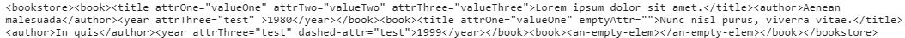
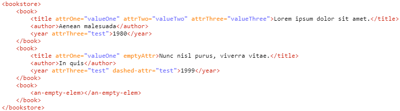
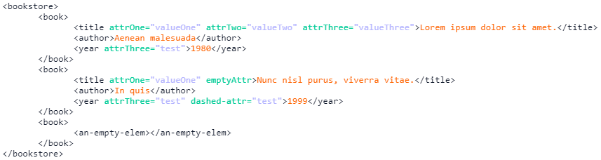
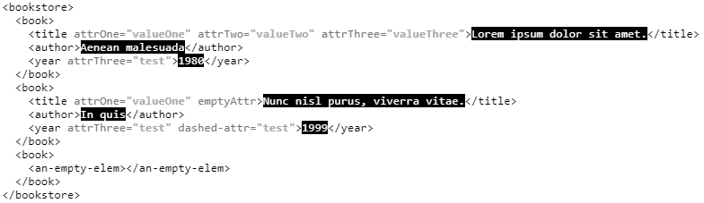

# XmlReadableConsoleLog #

This is a JavaScript library that allows you to print out your XML data on your browser's console in a readable way, by making use of `console.log`'s CSS parsing functionality. 
This library is used specifically for debugging purposes.

Keep in mind that you can display your XML readably without this API, browsers do that natively. However, this library still leverages the ability to display your data in a customizable way. 

## Examples ##

Let's say that you receive a server response that contains some XML data in string format, and you print it out on your JS console, the value itself might look something along the lines of: 



Which is clearly unreadable, but this library allows you to display your data as:  



## API ##

### xmlReadableLog(xmlData, settings) ###

Simply call `xmlReadableLog` and add the XML data either as a `String` or as an actual `XML` object. 

```javascript 

//without custom settings
xmlReadableLog(xml);

```

Alternatively, you can also add your own custom settings as the second parameter (These are all of the custom settings that can be applied). 

```javascript 

//with custom settings
xmlReadableLog(xml, {
	tabSize: 7,
	css: {
		element: 'color: #0a1429',
		attrName: 'color: #00cc99',
		attrValue: 'color: #b3b3ff',
		text: 'color: #ff6600',
	}
});

``` 

The output for the above example will look like: 



### xmlReadableLog.globalSettings ###

Another option is to use the `xmlReadableLog.globalSettings` object to override the default settings. 

To change the default CSS for `element`, `attrName`, `attrValue`, or `text`, use the `xmlReadableLog.globalSettings.setCSS(String, String)` and add one of the attributes as the first parameter and the CSS markup as the second.

To override the default tab size, use `xmlReadableLog.globalSettings.setTabSize(Integer)`. 

The following code demonstrates the `setCSS` and `setTabSize` functions.  

```javascript

//setting up the global settings
xmlReadableLog.globalSettings.setCSS('element', 'color: #000');
xmlReadableLog.globalSettings.setCSS('attrName', 'color: #737373');
xmlReadableLog.globalSettings.setCSS('attrValue', 'color: #a6a6a6; font-weight: bold;');
xmlReadableLog.globalSettings.setCSS('text', 'color: #fff; background-color: #000');
xmlReadableLog.globalSettings.setTabSize(2);
xmlReadableLog(xml);

```

Alternatively, you can pass a key-value paired object to apply your custom CSS settings: 

```javascript 

xmlReadableLog.globalSettings.setCSS({
	element: 'color: #000',
	attrName: 'color: #737373',
	attrValue: 'color: #a6a6a6; font-weight: bold;',
	text: 'color: #fff; background-color: #000'
});

```

The above result will look like: 



## Browser Compatibility ##

Some browsers do not support the console log CSS formatting, so the API won't work as expected. 

Known browsers that do support CSS formating are:

* [Chrome](https://developers.google.com/web/tools/chrome-devtools/console/console-write#string_substitution_and_formatting)
* [Mozilla](https://developer.mozilla.org/en-US/docs/Web/API/Console#Styling_console_output)

Moreover, if you're using a browser that does not support CSS formatting, you won't run into any major issues or errors, the only thing that will happen is that the CSS won't be applied. 