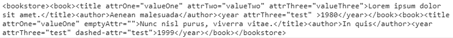
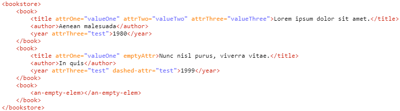
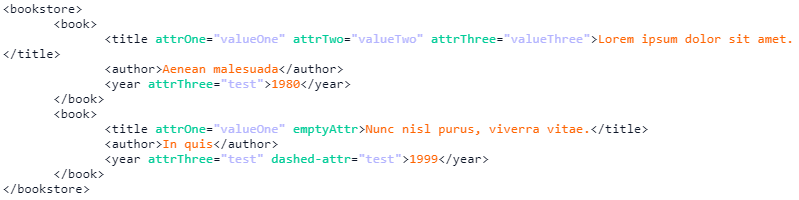
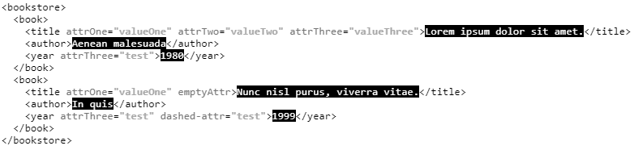

# XmlReadableConsoleLog #

This is a JavaScript library that allows you to print out your XML data on your browser's console in a readable way, by making use of `console.log`'s CSS parsing functionality. 
This library is used specifically for debugging purposes which involves handling XML data. 

# Examples #

Let's say you receive a server response that contains some XML data, and you print it out on your JS console, the value itself might look something in the lines of: 



Which is clearly unreadable, but this library allows you to display our data as:  



# API #

Simply call `XmlReadableConsoleLog` and add the XML data either as a `String` or as an actual `XML` object. 

```javascript 

//without custom settings
XmlReadableConsoleLog(xml);

```

Alternatively, you can also add your own custom settings as the second parameter (These are all of the custom settings that can be applied). 

```javascript 

//with custom settings
XmlReadableConsoleLog(xml, {
	tabSize: 7,
	css: {
		element: 'color: #0a1429',
		attrName: 'color: #00cc99',
		attrValue: 'color: #b3b3ff',
		text: 'color: #ff6600',
	}
});

``` 

The output for the above custom settings will look like: 



Another option is to use the `XmlReadableConsoleLog.globalSettings` object to override the default settings. 

To change the default CSS for `element`, `attrName`, `attrValue`, or `text`, use the `XmlReadableConsoleLog.globalSettings.setCSS(String, String)` and add one of the attributes as the first parameter and the CSS markup as the second.
To override the default tab size, use `XmlReadableConsoleLog.globalSettings.setTabSize(Integer)`. 
The following code demonstrates the `setCSS` and `setTabSize` functions.  

```javascript

//setting up the global settings
XmlReadableConsoleLog.globalSettings.setCSS('element', 'color: #000');
XmlReadableConsoleLog.globalSettings.setCSS('attrName', 'color: #737373');
XmlReadableConsoleLog.globalSettings.setCSS('attrValue', 'color: #a6a6a6; font-weight: bold;');
XmlReadableConsoleLog.globalSettings.setCSS('text', 'color: #fff; background-color: #000');

XmlReadableConsoleLog.globalSettings.setTabSize(2);

XmlReadableConsoleLog(xml);

```

The above result will look like: 

